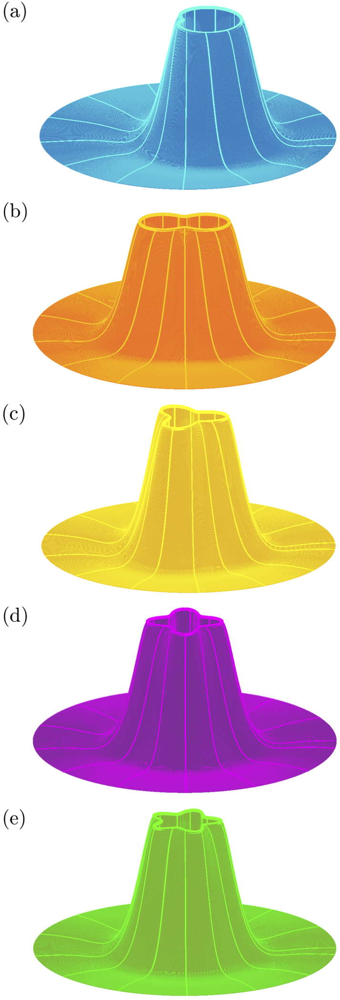

# CSCI596FINAL



> Boundary Value Method

---

### Table of Contents

- [Physical Problem](#physical-problem)
- [Computational Problem](#computational-problem)
- [How To Use](#computational-problem)
- [References](#references)
- [License](#license)
- [Author Info](#author-info)

---

## Description

Creating ReadMe's for your Github repository can be tedious.  I hope this template can save you time and effort as well as provide you with some consistency across your projects.

#### Software

- C++
- Arblib library (version 2.17 or newer)
- Carlos_Membrane_Project
- OpenMP
- OpenMPI

[Back To The Top](#read-me-template)

---

## How To Use
1. $ make clover
2. $ bash job
#### Installation
1. Download github repo. This will contain the necessary make file, bash script, and source code files
2. Install Arblib library by Frederick Johansson (version 2.17 or newer). You can build from source [1] or download as a package through anaconda3.
3. Install OpenMP.
4. Install OpenMPI (if you want to do multiple protein runs)


#### API Reference

```html
    <p>dummy code</p>
```
[Back To The Top](#read-me-template)

---

## References
[Back To The Top](#read-me-template)

---

## License

MIT License

Copyright (c) [2017] [James Q Quick]

Permission is hereby granted, free of charge, to any person obtaining a copy
of this software and associated documentation files (the "Software"), to deal
in the Software without restriction, including without limitation the rights
to use, copy, modify, merge, publish, distribute, sublicense, and/or sell
copies of the Software, and to permit persons to whom the Software is
furnished to do so, subject to the following conditions:

The above copyright notice and this permission notice shall be included in all
copies or substantial portions of the Software.

THE SOFTWARE IS PROVIDED "AS IS", WITHOUT WARRANTY OF ANY KIND, EXPRESS OR
IMPLIED, INCLUDING BUT NOT LIMITED TO THE WARRANTIES OF MERCHANTABILITY,
FITNESS FOR A PARTICULAR PURPOSE AND NONINFRINGEMENT. IN NO EVENT SHALL THE
AUTHORS OR COPYRIGHT HOLDERS BE LIABLE FOR ANY CLAIM, DAMAGES OR OTHER
LIABILITY, WHETHER IN AN ACTION OF CONTRACT, TORT OR OTHERWISE, ARISING FROM,
OUT OF OR IN CONNECTION WITH THE SOFTWARE OR THE USE OR OTHER DEALINGS IN THE
SOFTWARE.

[Back To The Top](#read-me-template)

---

## Author Info

- LinkedIn - [Carlos Alas LI](https://www.linkedin.com/in/carlos-alas-6a4643160/)
- ResearchGate - [Carlos Alas RG](https://www.researchgate.net/profile/Carlos_Alas3)

[Back To The Top](#read-me-template)
